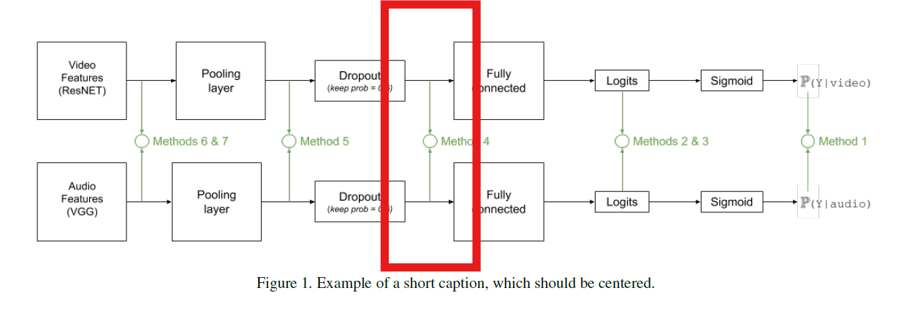
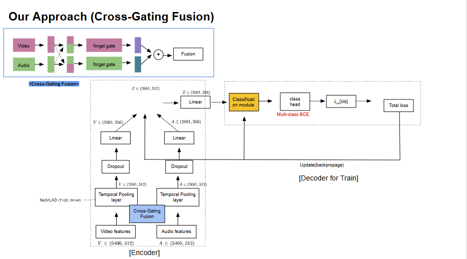
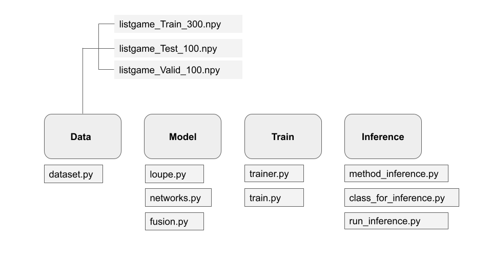

# :soccer: video-highlight-extraction
21기 전하은 | 22기 서동환 조해진

### 1. Project

This project aims to generate video highlight from given video and audio of Soccer game. Base model is from Action-spotting model following [Vanderplaetes and Dupont (2020)](https://arxiv.org/abs/2011.04258) 
 and [its implementation](https://github.com/bastienvanderplaetse/SoccerNetMultimodalActionSpotting). Major adaptations are as follows. (1) This project handles **both actions spotting and generating video highlights** (2) It also **explores different fusion methods** including GMU, CMGA and transformer encoder to effective process video and audion fusion. 

We define the problem as ① Classifying input chunks to events of interests from a soccer game ② Spotting the event as 'peak' using the threshold ③ Spanning the spotted event to generate video


### 2. Data

All datasets are from SoccerNet. Features are extracted from pretrained models with video data from ResNet152 and audio data from VGGish. For new input, data of each modality goes through the following procedure.

 ```
Video -> ResNet152 -> TruncatedSVD -> compress feature dimension to 512

 Audio -> VGGish -> PCA -> expand feature dimension to 512
```

Additionally, we have re-organized 18 labels into 4 classes for the task. 
Following is the events of interest. 
```
① goal # Shots on-target # Goal
② Kick # penalty kick # Free kick # corner kick
③ Subs 
④ Card # yellow # red # yellow->red
⑤ BG #background
# Discard # Pass # Throw-in # Kick-off # Shots off target # Ball out of play # Clearance # offisde # Foul # Drive 
```


### 3. Architecture

The base model from Vanderplaetes and Dupon (2020) employs early fusion by concatenating audio and video input right before the final FC. 

<p align="center">

</p>
 
#### Encoder
Main difference of our model from the base model is the method of fusion. We have explored different fusion methods from (1) GMU(Gated Multi-Modal Unit) to (2) CMGA(Cross-Modality Gated Attention) and (3) Transformer encoder instead of simple concatenation. 


#### Decoder (Inference) 
With the given logits from encoder, decoder spot peaks and span spotted peaks with pre-defined offsets to generate Highlights


<p align="center">
  
  
</p>


### 4. Usage

```bash
git clone https://github.com/Donghwan127/video-highlight-extraction
cd #repo
pip install -r requirements.txt

# train 
python ClassificationMinuteBased.py --architecture GMU--training listgame_Train_300.npy --validation listgame_Valid_100.npy --testing listgame_Test_100.npy --featuresVideo ResNET --featuresAudio VGGish --PCA --network VLAD --tflog Model --VLAD_k 128--WindowSize 20 --outputPrefix vlad-**gmu-20sec  --formatdataset 1
```
```
# inference
bash run_inference.sh
```
```
# post-process (Generate High-light Video)
 python3 post_process.py \
  /mnt/d/workspace/KUBIG/features_video_fps/2_720p.mkv \    # raw video path
  /mnt/d/workspace/KUBIG/video-highlight-extraction/inference_out/2_720p.json \   # path of inference output .json file
  /mnt/d/workspace/KUBIG/video-highlight-extraction/inference_out/2_720p_highlights.mp4   # output path
```


### 5. Code Structure


### 6. References
[Vaderplaestse and Dupont (2020)](https://arxiv.org/abs/2011.04258). Improved Soccer Action Spotting using both Audio and Video Streams

[Jiang and Ji (2022)](https://arxiv.org/abs/2208.11893). Cross-Modality Gated Attention Fusion for Multimodal Sentiment Analysis. 

[John et al. (2017)](https://arxiv.org/abs/2208.11893).  Gated Multimodal Units for Information Fusion.

[Giancola et al. (2018)](https://arxiv.org/abs/1804.04527). SoccerNet: A Scalable Dataset for Action Spottin in Soccer Videos.

### 7. Contributors
**Donghwan Seo** | [ github | Donghwan127](https://github.com/Donghwan127)   


Adapted base model source codes for highlight-generating task including adjusting class label and class weight while training 

Ran experiments using different architectures, losses and weight control


**Haejin Cho** | [github | Mockdd](https://github.com/Mockdd)  

Implemented and integrated Cross-Modality Gated Attention and Attention Bottleneck into the architecture with different merge points


**Haeune Jeon** | [github | Haeune-Jeon](https://github.com/Haeune-Jeon)   
github

Implemented and integrated Gated Modality Unit and Transformer Encoder into the architecture

implemented inference codes for highlight video generation.

Ran experiments using different architectures, losses and weight control

---
This project is part of [KUBIG](https://www.kubigkorea.com/)  2025 FALL contest. 

